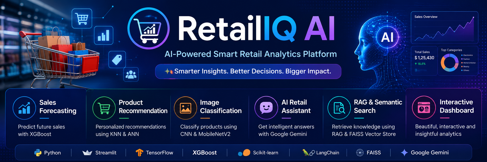

<p align="center">
  
</p>

<h1 align="center">🛍️ RetailIQ AI</h1>

<p align="center">
<b>AI-Powered Smart Retail Analytics Platform</b><br>
Sales Forecasting • Product Recommendation • Image Classification • AI Assistant
</p>

<p align="center">

[](https://www.python.org/)
[](https://streamlit.io/)
[](https://tensorflow.org/)
[](https://xgboost.ai/)
[](LICENSE)

</p>

---

# 🌐 Live Demo

🚀 **RetailIQ AI**

👉 https://sumit312-cpu-retail-iq-projects-appapp-mvvps9.streamlit.app/

---

# 📦 GitHub Repository

👉 https://github.com/sumit312-cpu/RETAIL_IQ_PROJECTS

---

# 📖 Project Overview

RetailIQ AI is an end-to-end AI-powered retail analytics platform that integrates **Machine Learning**, **Deep Learning**, **Recommendation Systems**, and **Generative AI** into a single interactive application.

The platform enables retailers and analysts to:

- 📈 Forecast future sales
- 🎯 Recommend products
- 🖼️ Classify product images
- 🤖 Interact with an AI Retail Assistant
- 📚 Retrieve project knowledge using RAG

The application is built using **Python** and **Streamlit** with an interactive and user-friendly interface.

---

# 🚀 Features

- 📈 Sales Forecasting using XGBoost
- 🎯 Product Recommendation using ANN & KNN
- 🖼️ Product Image Classification using CNN & MobileNetV2
- 🤖 AI Retail Assistant using Google Gemini
- 📚 Retrieval-Augmented Generation (RAG)
- 🔍 Semantic Search using FAISS
- 📊 Interactive Streamlit Dashboard

---

# 🛠️ Tech Stack

### Programming Language

- Python

### Frontend

- Streamlit

### Machine Learning

- Scikit-learn
- XGBoost

### Deep Learning

- TensorFlow
- Keras
- CNN
- MobileNetV2
- Artificial Neural Network (ANN)

### AI & LLM

- Google Gemini
- LangChain
- Retrieval-Augmented Generation (RAG)

### Vector Database

- FAISS
- Sentence Transformers

### Data Processing

- Pandas
- NumPy

### Visualization

- Plotly
- Matplotlib

### Development Tools

- Git
- GitHub
- VS Code
- Jupyter Notebook

---

# 📂 Project Structure

```text
RETAIL_IQ_PROJECTS/
│
├── App/
│   ├── app.py
│   ├── test.py
│   └── test_ann.py
│
├── Docs/
│
├── models/
│
├── screenshots/
│
├── utils/
│
├── VectorStore/
│
├── assets/
│   └── banner.png
│
├── requirements.txt
├── runtime.txt
├── README.md
├── .gitignore
└── .env
```

---

# 📸 Application Screenshots

## 🏠 Home Dashboard


---

## 📈 Sales Forecasting


---

## 🎯 Product Recommendation


---

## 🖼️ Product Image Classification


---

## 🤖 AI Retail Assistant


---

# ⚙️ Installation

### Clone Repository

```bash
git clone https://github.com/sumit312-cpu/RETAIL_IQ_PROJECTS.git
```

### Navigate to Project

```bash
cd RETAIL_IQ_PROJECTS
```

### Install Dependencies

```bash
pip install -r requirements.txt
```

### Configure Environment Variables

Create a `.env` file.

```env
GOOGLE_API_KEY=YOUR_GOOGLE_API_KEY
```

### Run the Application

```bash
streamlit run App/app.py
```

---

# 🚀 Deployment

The application is successfully deployed on **Streamlit Community Cloud**.

### Live Demo

👉 https://sumit312-cpu-retail-iq-projects-appapp-mvvps9.streamlit.app/

### Python Runtime

```
Python 3.11
```

---

# 🤖 AI Models Used

| Model | Purpose |
|--------|----------|
| XGBoost | Sales Forecasting |
| ANN | Product Recommendation |
| KNN | Recommendation Engine |
| CNN | Product Image Classification |
| MobileNetV2 | Transfer Learning |
| Google Gemini | AI Assistant |
| FAISS | Semantic Search |
| Sentence Transformers | Text Embeddings |
| LangChain | RAG Pipeline |

---

# 📌 Core Modules

- 📈 Sales Forecasting
- 🎯 Product Recommendation
- 🖼️ Product Image Classification
- 🤖 AI Retail Assistant
- 📚 RAG Knowledge Retrieval
- 🔍 Semantic Search

---

# 🚀 Future Enhancements

- User Authentication
- Customer Analytics
- Inventory Management
- Real-time Sales Dashboard
- PDF Report Generation
- Cloud Database Integration
- Multi-language Support

---

# 👨‍💻 Author

## Sumit Tiwari

**Data Scientist | Machine Learning Engineer | Generative AI Enthusiast**

### 🌐 GitHub

https://github.com/sumit312-cpu

### 🚀 Live Demo

https://sumit312-cpu-retail-iq-projects-appapp-mvvps9.streamlit.app/

---

# ⭐ Support

If you found this project useful, please consider giving it a ⭐ on GitHub.

It motivates future improvements and helps others discover the project.

---

# 🙏 Acknowledgements

- Streamlit
- TensorFlow
- Scikit-learn
- XGBoost
- LangChain
- Google Gemini
- FAISS
- Hugging Face