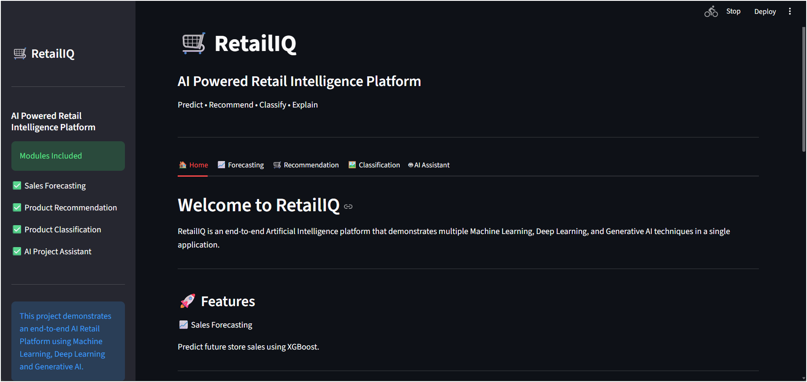
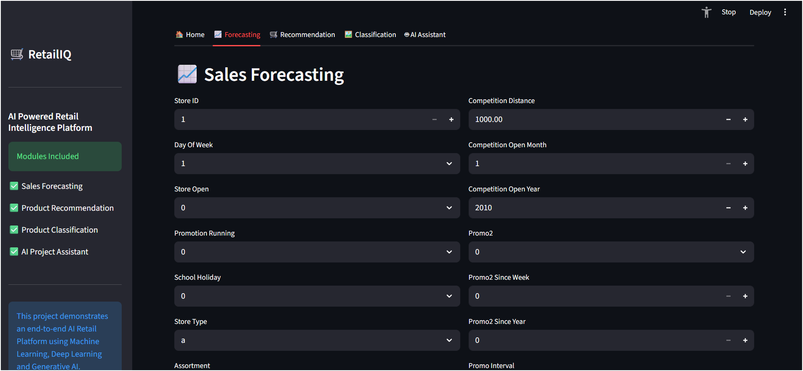
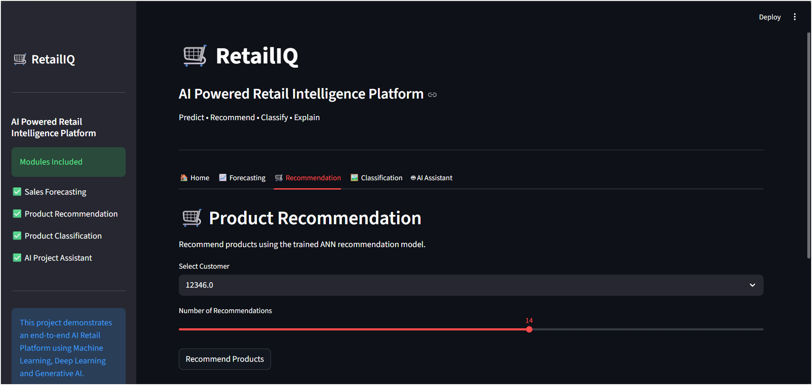
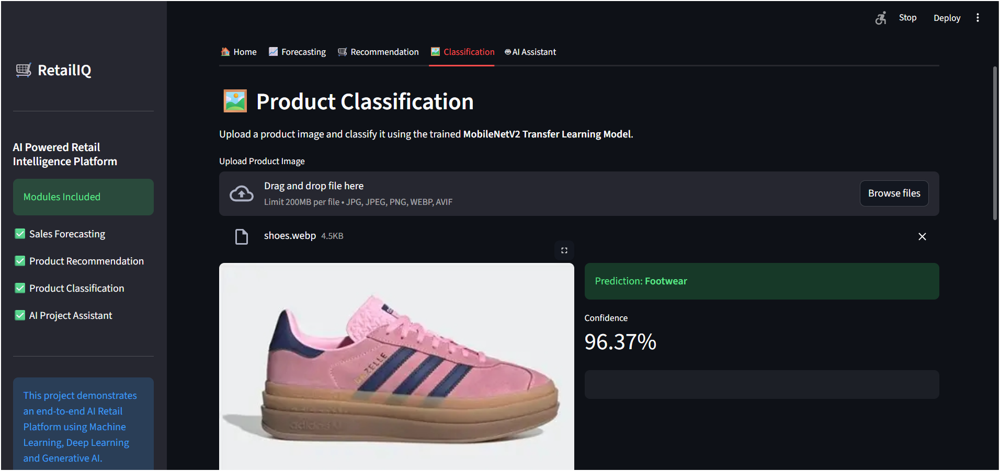
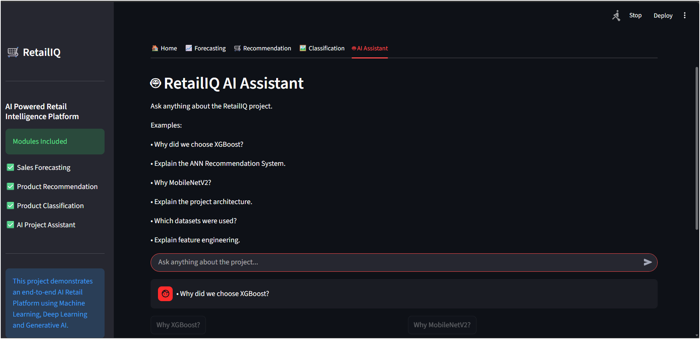

# 🛍️ RetailIQ AI

<p align="center">
  <b>AI-Powered Smart Retail Analytics Platform</b>
</p>

RetailIQ AI is a comprehensive retail analytics platform that combines **Machine Learning**, **Deep Learning**, **Recommendation Systems**, **Sales Forecasting**, and **Generative AI** to help retailers gain actionable insights and improve business decision-making.

The application is developed using **Python** and **Streamlit**, providing an interactive dashboard for forecasting sales, classifying products, recommending products, and answering retail-related queries through an AI-powered assistant.

---

# 🚀 Features

- 📈 Sales Forecasting using XGBoost
- 🖼️ Product Image Classification using CNN & MobileNetV2
- 🎯 Product Recommendation using KNN & ANN
- 🤖 AI Retail Assistant powered by Google Gemini
- 📚 Retrieval-Augmented Generation (RAG)
- 🔍 Semantic Search using FAISS Vector Store
- 📊 Interactive Streamlit Dashboard

---

# 🛠️ Tech Stack

### Programming Language
- Python

### Framework
- Streamlit

### Machine Learning
- Scikit-learn
- XGBoost

### Deep Learning
- TensorFlow
- Keras
- Convolutional Neural Networks (CNN)
- MobileNetV2
- Artificial Neural Networks (ANN)

### AI & LLM
- Google Gemini API
- LangChain
- Retrieval-Augmented Generation (RAG)
- FAISS Vector Store

### Data Processing
- Pandas
- NumPy

### Visualization
- Plotly
- Matplotlib

### Development Tools
- Git
- GitHub
- VS Code
- Jupyter Notebook

---

# 📂 Project Structure

```text
RETAIL_IQ_PROJECTS/
│
├── App/
│   ├── app.py
│   ├── test.py
│   └── test_ann.py
│
├── Docs/
│   ├── architecture.md
│   ├── datasets.md
│   ├── forecasting.md
│   ├── recommendation.md
│   ├── faq.md
│   └── model_selection.md
│
├── models/
│   ├── ann_recommender.h5
│   ├── custom_cnn.keras
│   ├── mobilenetv2_classifier.keras
│   ├── xgboost_sales_forecaster.pkl
│   ├── product_lookup.csv
│   └── ...
│
├── screenshots/
│   ├── home.png
│   ├── forecasting.png
│   ├── recommendation.png
│   ├── classification.png
│   └── chatbot.png
│
├── utils/
│   ├── assistant_ui.py
│   ├── build_vectorstore.py
│   ├── chat.py
│   ├── classification_ui.py
│   ├── forecasting_ui.py
│   ├── gemini.py
│   ├── rag.py
│   └── recommendation_ui.py
│
├── VectorStore/
│   ├── documents.pkl
│   └── index.faiss
│
├── requirements.txt
├── .gitignore
├── README.md
└── .env
```

---

# 📸 Application Screenshots

## 🏠 Home Dashboard



---

## 📈 Sales Forecasting



---

## 🎯 Product Recommendation



---

## 🖼️ Product Image Classification



---

## 🤖 AI Retail Assistant



---

# ⚙️ Installation

### Clone Repository

```bash
git clone https://github.com/sumit312-cpu/RETAIL_IQ_PROJECTS.git
```

### Navigate to Project

```bash
cd RETAIL_IQ_PROJECTS
```

### Install Dependencies

```bash
pip install -r requirements.txt
```

### Configure Environment Variables

Create a `.env` file in the project root:

```env
GOOGLE_API_KEY=YOUR_GOOGLE_API_KEY
```

### Run the Application

```bash
streamlit run App/app.py
```

---

# 🤖 AI Models

| Model | Purpose |
|--------|----------|
| XGBoost | Sales Forecasting |
| CNN | Product Image Classification |
| MobileNetV2 | Transfer Learning |
| KNN | Product Recommendation |
| ANN | Personalized Recommendation |
| Google Gemini | AI Retail Assistant |
| FAISS | Semantic Search |
| LangChain | RAG Pipeline |

---

# 📌 Core Modules

- 📈 Sales Forecasting
- 🖼️ Product Image Classification
- 🎯 Product Recommendation
- 🤖 AI Retail Assistant
- 📚 RAG Knowledge Retrieval
- 🔍 Semantic Document Search

---

# 🚀 Future Enhancements

- User Authentication
- Inventory Management
- Real-time Sales Dashboard
- PDF & Excel Report Generation
- Cloud Deployment
- Customer Analytics
- Multi-language Support

---

# 👨‍💻 Author

**Sumit Tiwari**

**Aspiring Data Scientist | Machine Learning Engineer | Generative AI Enthusiast**

GitHub: https://github.com/sumit312-cpu

---

# ⭐ Support

If you found this project useful, consider giving it a ⭐ on GitHub.